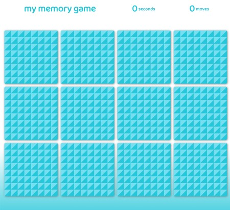
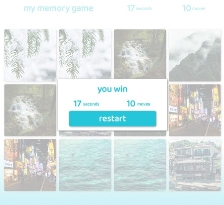

# my memory game

Simple & minimalistic memory game.

Play it [here](https://mathiasfontain.at/memorygame).

A little memory game made in **React.js** with **Material UI**, as well as the **React-Reveal** and **React-Tilt** animation libraries.

## Links

* [React.js](https://reactjs.org/)
* [Material UI](https://material-ui.com/)
* [React-Reveal](https://www.react-reveal.com/)
* [React-Tilt](https://www.npmjs.com/package/react-tilt)